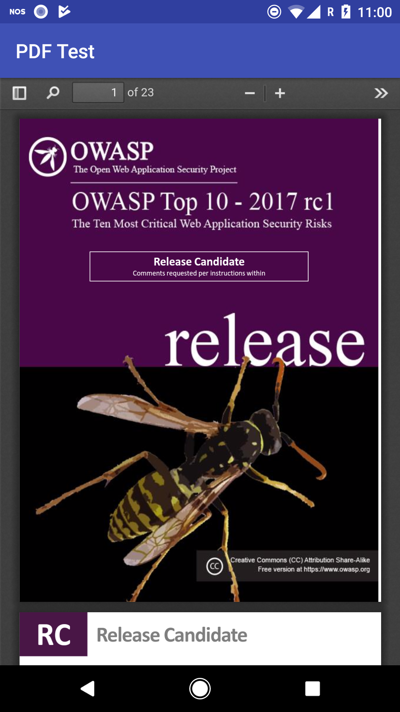

# PDFTest

This add demonstrates a PDF document viewer inside a WebView with the use of [pdf.js](https://github.com/mozilla/pdf.js/).

### Install

Install the `test.pdf` on an Android device on the external storage path:

`adb push test.pdf /sdcard/test.pdf`

And build 'n run the app on the same device. et voilà

## Screenshot

